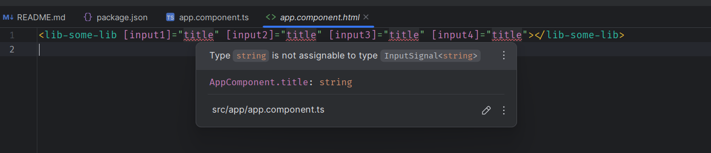

# Reproducing Angular Input Signal Type Mismatch in WebStorm v2024.1.5 with Angular v18.1.0

## Issue Overview

This README details a specific issue encountered in **WebStorm v2024.1.5** when using **Angular v18.1.0**, specifically with the use of `InputSignal` properties in an Angular library component. The issue occurs when importing a standalone component with signal-based inputs from an external Angular library into a separate Angular project.

### Description of the Issue

While passing string data to the inputs of the standalone component from an external Angular library, **WebStorm** throws a type mismatch error. It states that a type `string` is not assignable to the expected type `InputSignal<string>`. This error occurs even though the inputs and component have been properly configured in the library.

The error message observed is as follows:

```
Type string is not assignable to type InputSignal<string>
```

See the screenshot attached to this README for more details.

**Important Note:** This issue is only reproducible when the two projects are opened in **separate WebStorm windows**. If both projects are opened in a single WebStorm window (from the root folder), the error does not appear.

### Reference

For more information on the issue, see the official WebStorm YouTrack issue:  
[Angular Type Mismatch When Passing Data to Angular Component Input Signal Property](https://youtrack.jetbrains.com/issue/WEB-68676/Angular-Type-Mismatch-When-Passing-Data-to-Angular-Component-Input-Signal-Property).

---

## Steps to Reproduce

1. Create two separate Angular projects:
   - **Project 1 (Library Project):** A library called `shared-lib` containing a component named `SomeLibComponent`.
   - **Project 2 (Main Project):** A main Angular project that consumes the library.

2. **Library Project Setup:**

   - In the `shared-lib` library, create a standalone component `SomeLibComponent` with signal inputs.

   ```typescript
   import {Component, input, InputSignal, InputSignalWithTransform} from '@angular/core';

   @Component({
     selector: 'lib-some-lib',
     standalone: true,
     imports: [],
     template: `
       <p>
         some-lib works!
       </p>
     `,
     styles: ``
   })
   export class SomeLibComponent {
     input1 = input<string>('');
     input2: InputSignal<string> = input<string>('');
     input3 = input<string, string>('', {
       transform: (value) => value + ''
     });
     input4: InputSignalWithTransform<string, string> = input<string, string>('', {
       transform: (value) => value + ''
     });
   }
   ```

   - Build the library by running the following command:

   ```bash
   npm run build-some-lib
   ```

3. **Main Project Setup:**

   - In the main project, install the library locally (ensure it is linked).
   - In the `AppComponent`, use the `SomeLibComponent`:

   ```html
   <lib-some-lib 
     [input1]="title" 
     [input2]="title" 
     [input3]="title" 
     [input4]="title">
   </lib-some-lib>
   ```

4. **WebStorm Setup:**
   - Open both projects in **separate WebStorm windows**. The issue will not appear if they are opened in the same window.
   
   - The error will appear in the Main Project window, showing a type mismatch between `string` and `InputSignal<string>`.

### Screenshot



## Environment

- **WebStorm:** v2024.1.5
- **Angular:** v18.1.0
- **Node.js:** v18.17.1
- **NPM:** v9.6.7

# Reproducing Angular Input Signal Type Mismatch in WebStorm v2024.1.5 with Angular v18.1.0

## Issue Overview

This README details a specific issue encountered in **WebStorm v2024.1.5** when using **Angular v18.1.0**, specifically with the use of `InputSignal` properties in an Angular library component. The issue occurs when importing a standalone component with signal-based inputs from an external Angular library into a separate Angular project.

### Description of the Issue

While passing string data to the inputs of the standalone component from an external Angular library, **WebStorm** throws a type mismatch error. It states that a type `string` is not assignable to the expected type `InputSignal<string>`. This error occurs even though the inputs and component have been properly configured in the library.

The error message observed is as follows:

```
Type string is not assignable to type InputSignal<string>
```

See the screenshot attached to this README for more details.

**Important Note:** This issue is only reproducible when the two projects are opened in **separate WebStorm windows**. If both projects are opened in a single WebStorm window (from the root folder), the error does not appear.

### Reference

For more information on the issue, see the official WebStorm YouTrack issue:  
[Angular Type Mismatch When Passing Data to Angular Component Input Signal Property](https://youtrack.jetbrains.com/issue/WEB-68676/Angular-Type-Mismatch-When-Passing-Data-to-Angular-Component-Input-Signal-Property).

---

## Steps to Reproduce

1. Create two separate Angular projects:
   - **Project 1 (Library Project):** A library called `shared-lib` containing a component named `SomeLibComponent`.
   - **Project 2 (Main Project):** A main Angular project that consumes the library.

2. **Library Project Setup:**

   - In the `shared-lib` library, create a standalone component `SomeLibComponent` with signal inputs.

   ```typescript
   import {Component, input, InputSignal, InputSignalWithTransform} from '@angular/core';

   @Component({
     selector: 'lib-some-lib',
     standalone: true,
     imports: [],
     template: `
       <p>
         some-lib works!
       </p>
     `,
     styles: ``
   })
   export class SomeLibComponent {
     input1 = input<string>('');
     input2: InputSignal<string> = input<string>('');
     input3 = input<string, string>('', {
       transform: (value) => value + ''
     });
     input4: InputSignalWithTransform<string, string> = input<string, string>('', {
       transform: (value) => value + ''
     });
   }
   ```

   - Build the library by running the following command:

   ```bash
   npm run build-some-lib
   ```

3. **Main Project Setup:**

   - In the main project, install the library locally (ensure it is linked).
   - In the `AppComponent`, use the `SomeLibComponent`:

   ```html
   <lib-some-lib 
     [input1]="title" 
     [input2]="title" 
     [input3]="title" 
     [input4]="title">
   </lib-some-lib>
   ```

4. **WebStorm Setup:**
   - Open both projects in **separate WebStorm windows**. The issue will not appear if they are opened in the same window.
   
   - The error will appear in the Main Project window, showing a type mismatch between `string` and `InputSignal<string>`.

### Screenshot


## Environment

- **WebStorm:** v2024.1.5
- **Angular:** v18.1.0
- **Node.js:** v18.17.1
- **NPM:** v9.6.7
